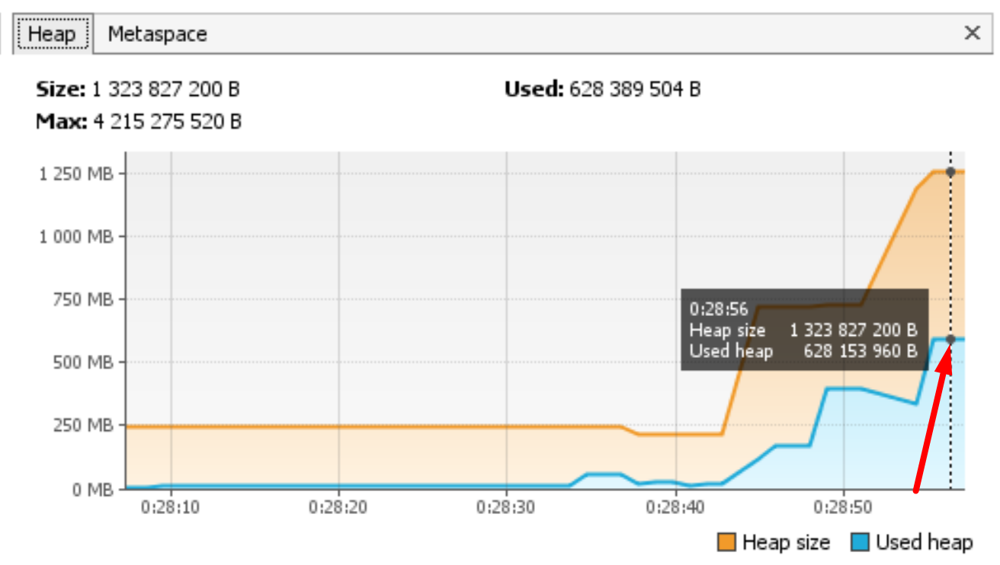

Домашнее задание для Netology.ru для курса Java Developer
Описание и инструкция к выполнению [здесь](https://github.com/netology-code/jd-homeworks/tree/master/jvm/README.md)

### Результат работы программы:
```
0:28:01: Executing task ':JvmExperience.main()'...

> Task :compileJava
> Task :processResources NO-SOURCE
> Task :classes

> Task :JvmExperience.main()
Please open 'ru.netology.JvmExperience' in VisualVm
00:28:34.030: loading io.vertx // загрузка классов из пакета io.vertx в metaspace

00:28:34.243: loaded 529 classes // загружено 529 классов, на графике Classes видно увеличение 
числа классов, значение на графике Heap немного подросло
```

```
00:28:37.252: loading io.netty // загрузка классов из пакета io.netty в metaspace

00:28:37.625: loaded 2117 classes // загружено 2117 классов, значение на графике Classes значительно выросло,
 значение Heap снизилось в результате работы Garbage Collector, значение Metaspace значительно выросло
```

```
00:28:40.634: loading org.springframework // загрузка классов из пакета org.springframework в metaspace

00:28:40.754: loaded 869 // загружено 869 классов, значение Classes выросло, продолжил рости Metaspace
```

```
00:28:43.760: now see heap // информационное сообщении о необходимости смотреть на загрузку в куче

00:28:43.760: creating 5000000 objects // создание 5 млн объектов

00:28:44.965: created // создано 5 млн объектов, количество классов практически не изменилось, 
значение Heap выросло из-за сознания большого количества объектов
```

```
00:28:47.972: creating 5000000 objects // создание 5 млн объектов

00:28:48.332: created // создано 5 млн объектов, 
значение Heap выросло из-за сознания большого количества объектов
```

``` 
00:28:51.354: creating 5000000 objects // создание 5 млн объектов

00:28:54.472: created // создано 5 млн объектов, зарезервированное значение Heap выросло, 
а использованное снизилось в результате работы Garbage Collector
```

```

BUILD SUCCESSFUL in 56s // Программа завершила работу, перед этим
зарезервированное и использованное значение Heap выросло
```

```
2 actionable tasks: 2 executed
0:28:58: Task execution finished ':JvmExperience.main()'.
```